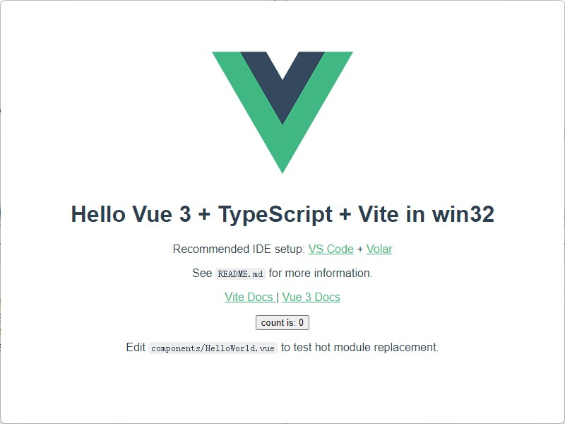

## Electron + Vue3 + vite-plugin-electron

使用`vite-plugin-electron`插件完美集成`Electron`、`Vue3`、`Vite`开发环境。

## 环境
当前支持版本：
- vue3：3.2.37
- electron：21.2.2
- electron-builder：23.3.3
- vite-plugin-electron：0.10.2